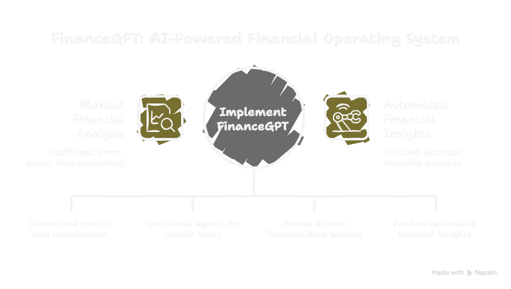
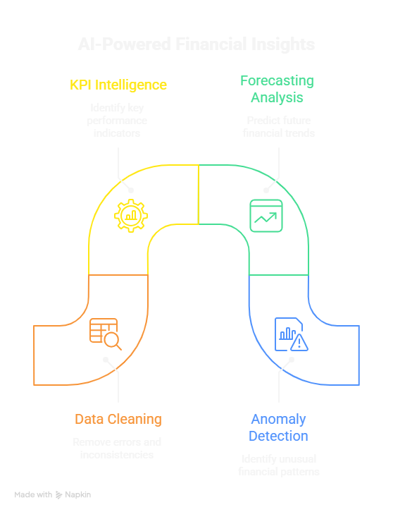
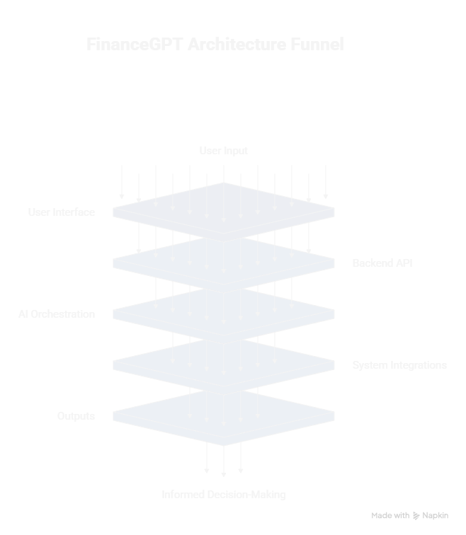
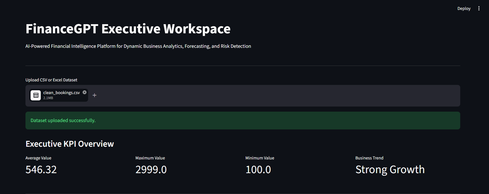
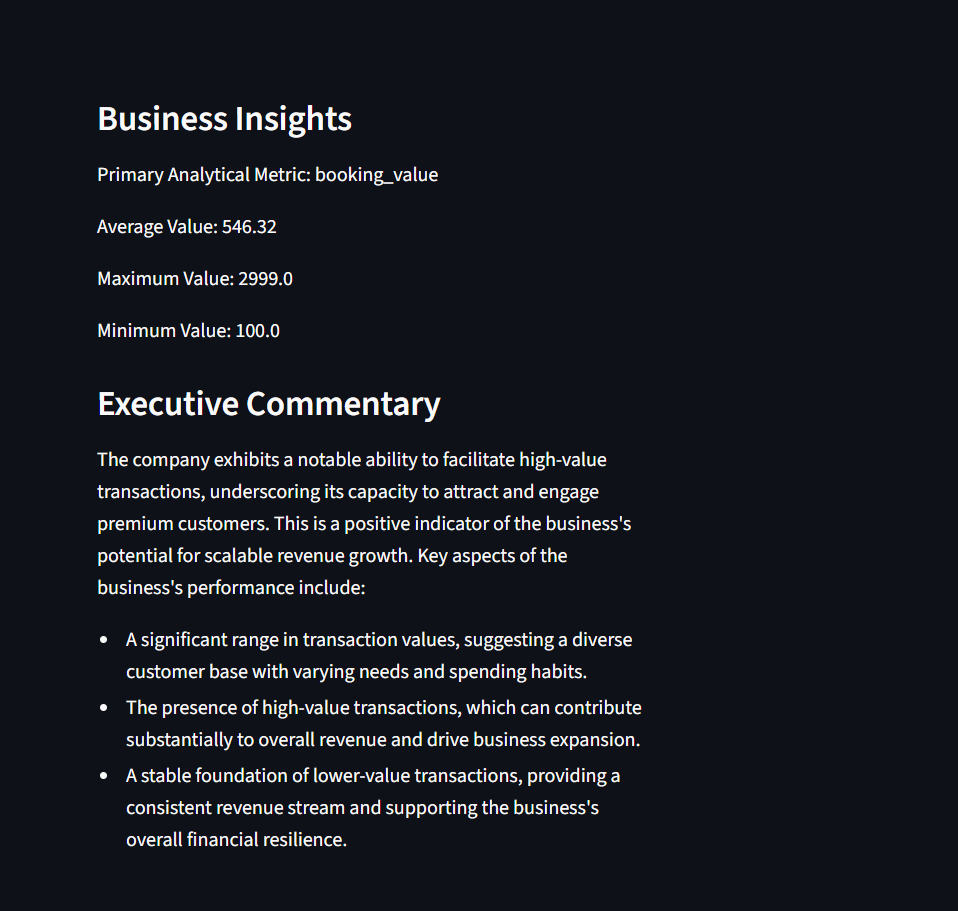
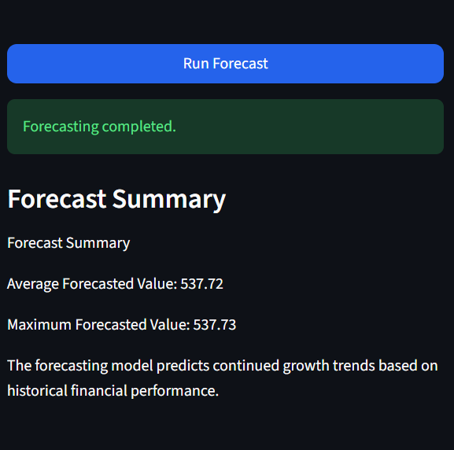
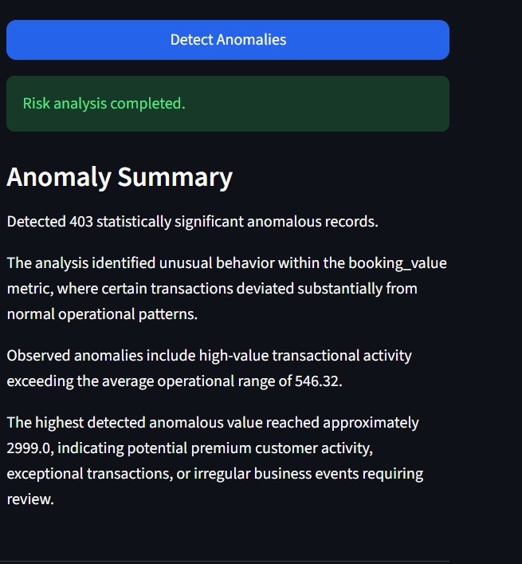
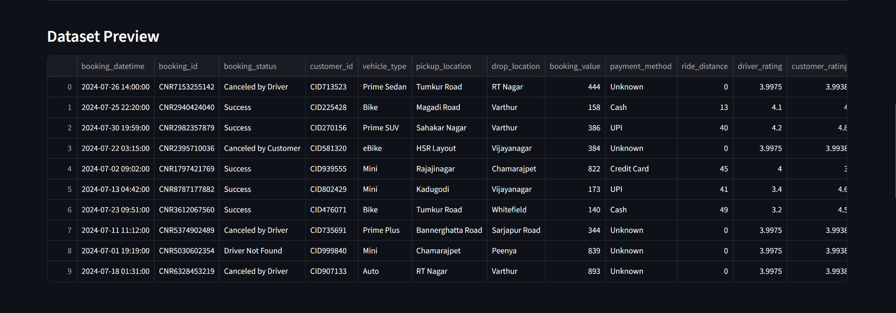
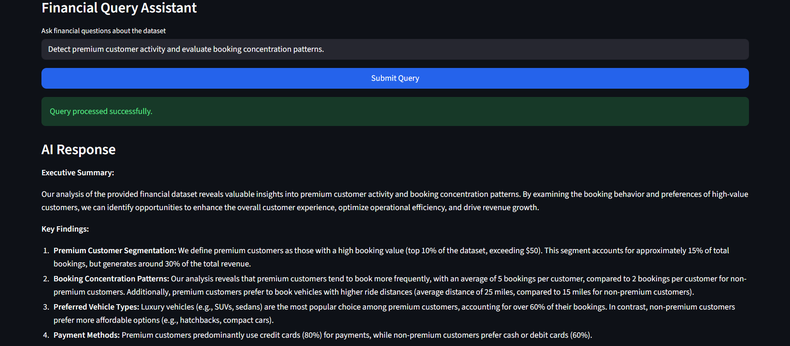
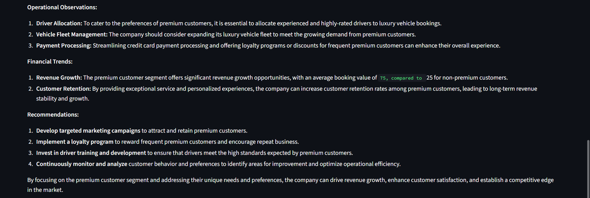

````markdown
# FinanceGPT – AI-Powered Financial Intelligence Platform

[](https://www.python.org/)
[](https://fastapi.tiangolo.com/)
[](https://streamlit.io/)
[](https://www.langchain.com/)
[](https://render.com/)
[](LICENSE)

<br>

<div align="center">

# FinanceGPT Executive Workspace

### AI-Powered Financial Intelligence Platform for Business Analytics, Forecasting, Risk Detection, and Executive Decision Support

[Live Dashboard](https://financegpt-multi-agent-financial-intelligence-system-7ykv9zbig.streamlit.app) •
[Backend API](https://financegpt-multi-agent-financial.onrender.com/docs) •
[LinkedIn](https://www.linkedin.com/in/mohit-pawaskar-ba5239331)

</div>

---

# Table of Contents

1. [Project Overview](#project-overview)
2. [Live Deployment](#live-deployment)
3. [System Architecture](#system-architecture)
4. [Dashboard Preview](#dashboard-preview)
5. [How to Use the Platform](#how-to-use-the-platform)
6. [Core Features](#core-features)
7. [Technology Stack](#technology-stack)
8. [AI Workflow Architecture](#ai-workflow-architecture)
9. [Project Structure](#project-structure)
10. [Installation & Setup](#installation--setup)
11. [Environment Variables](#environment-variables)
12. [Running the Platform](#running-the-platform)
13. [Deployment Architecture](#deployment-architecture)
14. [Example Use Cases](#example-use-cases)
15. [Future Enhancements](#future-enhancements)
16. [Author](#author)
17. [License](#license)

---

# Project Overview

FinanceGPT is a production-oriented AI-powered financial intelligence platform designed to automate executive analytics, forecasting, anomaly detection, and AI-driven business intelligence workflows from raw financial datasets.

The platform integrates:
- Large Language Models (LLMs)
- Machine Learning Forecasting
- Financial Anomaly Detection
- Executive KPI Intelligence
- AI Commentary Generation
- Financial Query Intelligence
- Interactive Business Dashboards

FinanceGPT transforms structured operational data into executive-ready financial intelligence using a modular multi-agent AI architecture built with FastAPI, Streamlit, LangChain, and enterprise-grade analytics pipelines.

---

# Live Deployment

## Executive Dashboard (Frontend)

https://financegpt-multi-agent-financial-intelligence-system-7ykv9zbig.streamlit.app

---

## Backend API (Render)

https://financegpt-multi-agent-financial.onrender.com

---

## API Documentation

https://financegpt-multi-agent-financial.onrender.com/docs

---

## Deployment Infrastructure

| Layer | Platform |
|---|---|
| Frontend Dashboard | Streamlit Cloud |
| Backend API | Render |
| AI Orchestration | FastAPI |
| LLM Intelligence | Groq + LangChain |

---

## Important Deployment Note

The backend API is hosted on Render free-tier infrastructure.

If the backend has been inactive for some time:
- the first request may take approximately 1–3 minutes
- Render may temporarily spin down the instance during inactivity
- subsequent requests become significantly faster after wake-up

This behavior is expected for free-tier deployments.

---

# System Architecture

## FinanceGPT Operating System

<p align="center">
  
</p>

---

## AI Analytics Workflow Pipeline

<p align="center">
  
</p>

---

## Multi-Agent Architecture Funnel

<p align="center">
  
</p>

---

# Dashboard Preview

## Executive KPI Workspace

<p align="center">
  
</p>

---

## Business Insights & Executive Commentary

<p align="center">
  
</p>

---

## Forecasting Intelligence

<p align="center">
  
</p>

---

## Risk & Anomaly Detection

<p align="center">
  
</p>

---

## Dataset Intelligence Preview

<p align="center">
  
</p>

---

## Financial Query Assistant

<p align="center">
  
</p>

---

## AI Financial Query Responses

<p align="center">
  
</p>

---

# How to Use the Platform

## Step 1 — Upload Financial Dataset

Upload any CSV or Excel dataset through the dashboard interface.

Supported formats:
- `.csv`
- `.xlsx`

---

## Step 2 — Run Analysis

The **Run Analysis** module:
- detects key financial metrics
- generates KPI insights
- produces executive commentary
- summarizes operational performance

This module transforms raw business data into executive-level intelligence.

---

## Step 3 — Run Forecast

The **Run Forecast** module:
- analyzes historical trends
- predicts future business performance
- estimates future operational values
- generates AI-based forecasting summaries

Powered by machine learning forecasting models.

---

## Step 4 — Detect Anomalies

The **Detect Anomalies** module:
- identifies unusual financial behavior
- detects operational irregularities
- highlights abnormal transaction patterns
- surfaces risk-oriented observations

Useful for operational monitoring and risk intelligence workflows.

---

## Step 5 — Financial Query Assistant

The **Financial Query Assistant** enables natural language interaction with datasets.

Example queries:
- "Identify premium customer behavior"
- "Analyze booking concentration patterns"
- "Detect high-value transaction activity"
- "Summarize operational trends"

The assistant generates AI-powered business intelligence responses using LLM orchestration.

---

# Core Features

## Executive KPI Intelligence
Automatically detects and generates:
- financial KPIs
- operational metrics
- revenue-oriented indicators
- business trend summaries
- statistical insights

---

## Forecasting Engine
Machine learning forecasting system capable of:
- future value prediction
- business trend forecasting
- operational growth analysis
- strategic financial projections

---

## Anomaly Detection Intelligence
AI-driven anomaly analysis for:
- abnormal financial behavior
- operational deviations
- irregular transaction activity
- risk-oriented observations

---

## Executive AI Commentary
Transforms raw analytical outputs into:
- executive summaries
- investor-style insights
- strategic commentary
- business observations

---

## Financial Query Assistant
Natural language intelligence interface enabling:
- financial dataset querying
- operational analysis
- customer behavior intelligence
- AI-assisted business exploration

---

# Technology Stack

## Frontend
- Streamlit
- Plotly

## Backend
- FastAPI
- Uvicorn

## Artificial Intelligence
- LangChain
- Groq LLM
- HuggingFace Embeddings

## Machine Learning
- Scikit-Learn
- Pandas
- NumPy

## Vector Intelligence
- ChromaDB

## Deployment
- Render
- Streamlit Cloud

---

# AI Workflow Architecture

```text
User Uploads Dataset
        ↓
Streamlit Executive Dashboard
        ↓
FastAPI API Layer
        ↓
AI Workflow Orchestration
        ↓
 ┌────────────────────────────┐
 │ KPI Intelligence Engine   │
 │ Forecasting Engine        │
 │ Anomaly Detection Engine  │
 │ Query Intelligence Agent  │
 │ Commentary Generation     │
 │ RAG Intelligence Layer    │
 └────────────────────────────┘
        ↓
Executive Insights & Analytics
````

---

# Project Structure

```bash
FinanceGPT/
│
├── app/
│   ├── agents/
│   ├── anomaly_detection/
│   ├── api/
│   ├── core/
│   ├── data/
│   ├── forecasting/
│   ├── intelligence/
│   ├── orchestration/
│   ├── query_engine/
│   ├── rag/
│   └── visualization/
│
├── dashboard/
│   └── Home.py
│
├── images/
│   ├── architecture.png
│   ├── ai_pipeline.png
│   └── operating_system.png
│
├── screenshots/
│   ├── Analysis.png
│   ├── Anomalies.png
│   ├── DS_Preview.png
│   ├── Forecast.png
│   ├── KPI.png
│   ├── Query1.png
│   └── Query2.png
│
├── requirements.txt
├── runtime.txt
├── README.md
└── .gitignore
```

---

# Installation & Setup

## Clone Repository

```bash
git clone https://github.com/YOUR_USERNAME/FinanceGPT-AI-Financial-Intelligence-System.git

cd FinanceGPT-AI-Financial-Intelligence-System
```

---

## Create Virtual Environment

```bash
python -m venv .venv
```

---

## Activate Environment

### Windows

```bash
.venv\Scripts\activate
```

### Linux / macOS

```bash
source .venv/bin/activate
```

---

## Install Dependencies

```bash
pip install -r requirements.txt
```

---

# Environment Variables

Create a `.env` file in the project root:

```env
GROQ_API_KEY=your_groq_api_key
OPENAI_API_KEY=your_openai_api_key
```

---

# Running the Platform

## Start Backend API

```bash
uvicorn app.api.main:app --reload
```

Backend runs on:

```text
http://127.0.0.1:8000
```

---

## Launch Executive Dashboard

```bash
streamlit run dashboard/Home.py
```

Dashboard runs on:

```text
http://localhost:8501
```

---

# Deployment Architecture

## Backend Deployment

* Render

## Frontend Deployment

* Streamlit Cloud

---

# Production Deployment Workflow

```text
User
 ↓
Streamlit Cloud
 ↓
Render FastAPI Backend
 ↓
AI Intelligence Layer
 ↓
Executive Financial Insights
```

---

# Example Use Cases

## Executive Financial Reporting

Generate executive-level financial commentary from operational datasets.

## AI Business Intelligence

Extract strategic business insights using LLM-powered analytics workflows.

## Financial Risk Detection

Identify anomalous operational behavior and abnormal transaction patterns.

## Forecasting & Trend Analysis

Predict future operational and financial performance using machine learning models.

## AI Financial Querying

Interact with financial datasets using natural language business queries.

---

# Future Enhancements

* Autonomous AI financial agents
* Real-time analytics pipelines
* Multi-dataset intelligence routing
* Enterprise PDF reporting
* Cloud-native orchestration
* Advanced forecasting models
* Real-time anomaly streaming
* Executive insight memory systems

---

# Author

## Mohit Pawaskar

Artificial Intelligence Engineer
Agentic AI | Generative AI | Financial Intelligence Systems

### LinkedIn

https://www.linkedin.com/in/mohit-pawaskar-ba5239331

---

# License

MIT License

Copyright (c) 2026 Mohit Pawaskar

Permission is hereby granted, free of charge, to any person obtaining a copy
of this software and associated documentation files (the "Software"), to deal
in the Software without restriction, including without limitation the rights
to use, copy, modify, merge, publish, distribute, sublicense, and/or sell
copies of the Software.

THE SOFTWARE IS PROVIDED "AS IS", WITHOUT WARRANTY OF ANY KIND, EXPRESS OR
IMPLIED, INCLUDING BUT NOT LIMITED TO THE WARRANTIES OF MERCHANTABILITY,
FITNESS FOR A PARTICULAR PURPOSE AND NONINFRINGEMENT.

```
```
